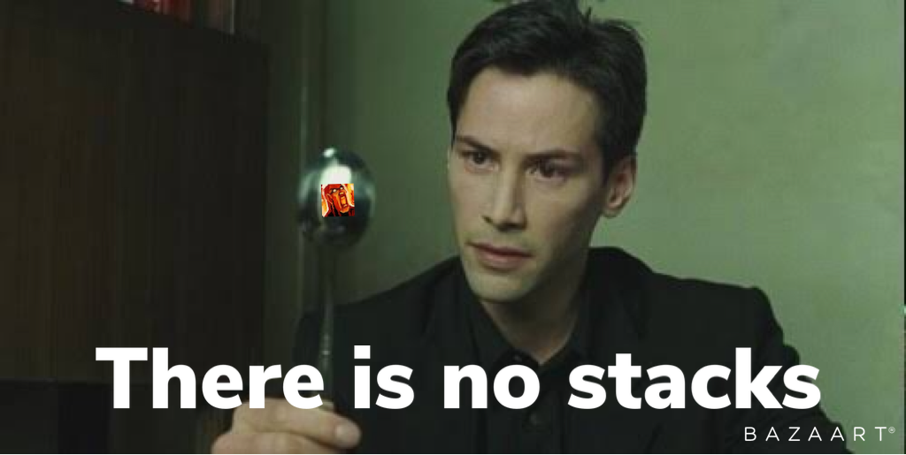
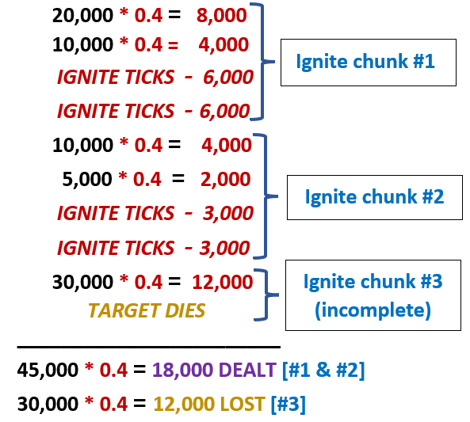
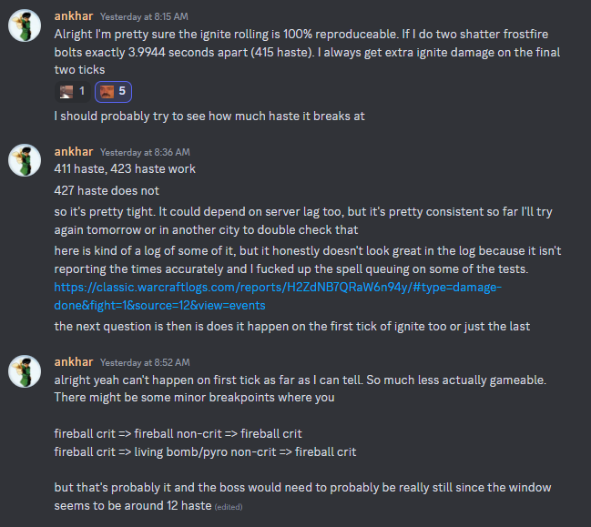

# Everything about ignite, I guess

The following is a collection of brief analyses conducted as part of an effort to gain a better understanding of the bugs (Munching and Vomit<sup>[disputed](#what-is-munching),[1](#ignite-bouncing),[2](#ignite-edging),[3](#spectral-ignite),[4](#ignite-duping),[5](#ignite-echo),[6](#ignite-dipping)</sup>) associated with Ignite, which have been a persistent and significant issue for Fire Mages in both the Classic version and the original Wrath of the Lich King (OG Wrath).

## GENERAL TL;DR

### WHAT WE KNEW BEFORE THIS

- Fire Mages, both those who use Fireball (TTW) and those who use Frostfire Bolt (FFB) are losing DPS due to ignite munching.

### WHAT WE KNOW NOW
- There is a second bug, referred in here as ignite vomit, which in a vacuum can result in a DPS gain.
- We can objectively show munching is a significantly greater issue for TTW Mages than FFB Mages.
- Although the negative effects of ignite munching are slightly less severe than what we expected due to Ignite Vomit, ignite munching remains a significant issue for all Fire Mages.
- Ignite Vomit has a "success rate"" of approximately 30% anytime a spell crits within a window of less than 40 milliseconds before the next ignite.

### IMPLICATIONS
- The Mage Sim has been updated to include an option for ignite vomit (a.k.a. bleeding). [Thanks [Osthy](https://github.com/Cheesehyvel/magesim-wotlk)]
- Ongoing efforts are being made to consistently replicate and induce ignite vomits in a real scenario, however, it is highly unlikely they will have any practical use.
- Through our analyses, we have gained a greater understanding of Fire Mage Ignite damage, the associated bugs, and their impact on our DPS.

# Table of Contents 📜

1. [Munching: The DPS missing from your Ignite](#-munching-the-dps-missing-from-your-ignite-)<br>
    1.1. [What is "munching"?](#what-is-munching)<br>
    1.2. [When is "munching"?](#when-is-munching) <br>
    1.3. [How to (workaround) "munching"?](#how-to-workaround-munching) <br>
    1.4. [Examples of munching](#examples-of-munching) <br>
    1.5. [Other munching sources](#other-munching-sources) <br>

2. [Vomit: When Ignite goes wrong for the best](#-vomit-when-ignite-goes-wrong-for-the-best-) <br>
    2.1. [What is "vomit"?](#what-is-vomit)<br>
    2.2. [When is "vomit"?](#when-is-vomit) <br>
    2.3. [Example of vomit 1](#practical-example) <br>
    2.4. [Example of vomit 2](#additional-examples) <br>
    2.5. [Partial vomit?](#additional-examples) <br>
    
3. [Quantifying ignite damage](#-quantifying-ignite-damage-)  <br>
    3.1. [Part 1 - The ignite formula](#part-1---the-ignite-formula) <br> 
    3.2. [Part 2 - Ignite chunks](#part-2---ignite-chunks) <br> 
    3.3. [Part 3 - Ignite, munching and vomit basic interactions](#part-3---ignite-munching-and-vomit-basic-interactions) <br> 
    3.4. [Part 4 - Measuring ignite across logs](#part-4---measuring-ignite-across-logs) <br>
    3.5. [Part 5 - EXPLANATION: Understanding the measurement](#part-5---understanding-the-measurement) <br>  
    
4. [The vomit window](#the-vomit-window-%EF%B8%8F)<br>  

5. [Inducing Vomit](#inducing-vomit-)<br>  

6. [Next steps](#things-not-yet-answered-next-steps)<br>

    A. [Other ignite analogies](#other-ignite-analogies)<br>

    B. [Vomit naming conventions](#naming-conventions)<br>

## 🔥 Munching: The DPS missing from your ignite 🔥 

#### **Tl,dr:** 

<ins> Ignite **munching**</ins> will sometimes happen to your ignite damage, and it <ins>is a DPS loss</ins>. More frequent on TTW Mages than FFB mages. As TTW, you can minimize its effects with a WA and/or a macro.

### What is "munching"?

Ignite munching is a well-documented bug [1,2,3] that can cause a loss of DPS for Fire Mages due to how spell interactions work. 

### When is "munching"?

In short, **munching** happens for the most part in 2 scenarios:

1. Living Bomb explosion crits at the same time or extremely close to a projectile critting (fireball, frostfirebolt, or pyroblast).
    - Ignite from the Living Bomb explosion gets munched. 

2. A Pyroblast crits immediately after or extremely close to another projectile crits (fireball or frostfirebolt).
    - Ignite from the projectile before the pyroblast will be munched.

### How to (workaround) "munching"?

Unless you are a TTW mage, there is not much you can do about it.

Because of how projectile travel times work, scenario #2 is more frequently observed among TTW Mages, with fireball having a different travel time compared to frostfire bolt.

The effects of munching on TTW mages can be mitigated by using WAs and macros, making it less likely to happen. 
You can check the FAQ or the commands "!munch" and "!fuckmunch" on [Mage Discord](https://discord.gg/eszwRckRmA) for more details.

However, **munching will STILL happen**, with or without weakauras, and regardless of spec (TTW or FFB).

To the best of our knowledge, this won't be fixed, but you can make yourself heard in the Blizzard Forums by making a post/thread about it.

### Examples of munching

Figure 1: Example of a munching scenario 1. [4]


Figure 2: Example of a munching scenario 1. Different spell [5]


Figure 3: Example of a munching scenario 2. [6]


### Other munching sources

Some boss mechanics will also "munch" your ignite damage. 

This type of munch should NOT be confused to the one caused by your spells critting too close to each other

Figure 4: Sartharion becomes immune and consumes the ignite damage, rendering it null. 


- <ins>**Kologarn:**</ins> While gripped, your ignites might be getting "munched" - Highly likely but not fully confirmed

- <ins>**Ignis:**</ins> Slag pot munches hot streaks. Probably ignites too but not confirmed.

- <ins>**XT heart:**</ins> Heart phase munching ignites <ins>is confirmed.</ins>

- <ins>**Sartharion:**</ins> Immune phase munching ignites <ins>is confirmed.</ins>


Figure 5: XT Heart phase "munching" an ignite - The ignite from the Living Bomb crit never gets to tick


### References

1.- [Ignite munching on its way out, one way or another February 23, 2011 ](https://www.engadget.com/2011-02-23-ignite-munching-on-its-way-out-one-way-or-another.html?guccounter=1&guce_referrer=aHR0cHM6Ly93d3cuZ29vZ2xlLmNvbS8&guce_referrer_sig=AQAAAD4s-zDY_aUerkO-18-cyhJQcrgeH8xubvmt371MBNuirIY9RqM4OMzpJpGb3Br798GnMxzw88aoKIwsa_BxHZ_ugd1B1hlkzZ7tW-8JqjSfmm2iLa_mik77fB3SBlYBlYYV73NCN7fBqA0yqsc_bQV-K2xutXyaVFT5x-8HaLlO)

2.- [Ignite Munching wiki article](https://wowwiki-archive.fandom.com/wiki/Ignite_(old))

3.- [!munch @ Mage Discord](https://discord.gg/eszwRckRmA)

4.- [Algalon encounter used for figure 1](https://classic.warcraftlogs.com/reports/WKhF9jBXbQ4MRwnx#fight=17&view=events&source=7&type=damage-done&eventstart=2790468)

5.- [Algalon encounter used for figure 2](https://classic.warcraftlogs.com/reports/FamxdM3W94RBTY87#fight=52&type=damage-done&source=19&view=events)

6.- [Another Algalon encounter for figure 3](https://classic.warcraftlogs.com/reports/pjxTCMtQk9c7d2ar#fight=16&type=damage-done&source=6&target=147&view=events&options=2)

## 🤮 Vomit: When Ignite goes wrong for the best 🤮

#### **Tl,dr:** 

<ins> Ignite **vomit**</ins> will sometimes happen to your ignite damage, and it <ins>is a DPS gain</ins>. Intentionally manipulating this bug in our favor seems unrealistic, if not impossible, until someone can induce it consistently AND demonstrate it can be used in a real scenario. 

### What is "vomit"?

A less well-documented Ignite bug in Wrath of the Lich King is the opposite of Ignite Munching (from now on, "Ignite Vomit"), which allows an ignite to keep rolling and result in an additional tick that should not have occurred.

Until recently (at the moment of writing), this bug had not been documented or described at all for Wrath of the Lich King Classic.

This bug was first discussed at length in OG Wrath in an [ElitistJerk forum thread in 2008 [1]](https://web.archive.org/web/20100412150438/http://elitistjerks.com/f31/t19766-mage_rolling_ignites_they_back/), and the first documented claim for it can be traced back to another [ElitistJerk thread in 2007[2]](https://web.archive.org/web/20110810120414/http://elitistjerks.com/f31/t12302-mage_ignites_working_correctly/).


Additionally, a brief explanation of the bug can be found in the [wow wiki section for Ignite Bugs, under the section "Known Bugs"](https://wowwiki-archive.fandom.com/wiki/Ignite_(old)#Past_changes), making reference to the 2008 EJ thread. 

Unlike "Ignite Munching", which has a section named for its own in the wiki, Ignite Vomit is simply described in one paragraph as something that can happen, but that should not be confused with the old "rolling" ignite system from pre-2.0 (known to us nowadays as "Classic").



Unlike Classic ignites, post-classic ignites have "no stacks" (and do not "roll" as before)


### When is "vomit"?

Vomit occurs when a spell crits as the same time (or extremely close) to an ignite tick.

Figure 1: Example of a vomit scenario. The spell before ignite crits/lands on the same timestamp as the ignite, according to logs.[3]


Figure 2: Example of a vomit scenario.  The spell before ignite crits/lands 28ms before the ignite.[4]


### Practical example

[The following log has a practical example, from figure 2,](https://classic.warcraftlogs.com/reports/a:mZaNPdTgzLFBVW8K#fight=3&type=damage&source=14&target=123&view=events) of vomit ocurring "naturally"

(log shared by @Redteam#9819 in [#🐲sim-and-log-review at Mage Discord](https://discord.gg/eszwRckRmA) long ago, and taken as an example after a vomit event was discovered months later)

00:39.416 seconds into the log the following happens

```
1.- Ignite tick for 6687

2.- Fireball crits for 7984 
[adds to ignite: 7984 * 0.4 = 3193] 
expected ignite tick: (6687+3193) / 2 =  4939

Immediately after the fireball:
3.- Ignite ticks for 6687

4.- Living bomb crits for 2007 
[adds to ignite: 2007 * 0.4 = 802]

5.- Fireball crits for 9393 
[adds to ignite:  9393 * 0.4 = 3757]

6.- Ignite ticks for 7220
```
To get a 7220 ignite tick you would need an ignite of 14440, which is only possible if the following happened:

3193 (From 2.- Fireball) + 802 (From 4.- LB) + 3757 (From 5.- FB) + 6686 (From 3.- IG due to "Vomit")

Doing :

**(A)** 802 (4.- LB) + 3757 (5.- FB) + 3193 (2.- FB)  = 7752 / 2 = 3876

or

**(B)** 802 (4.- LB) + 3757 (5.- FB) + 6686 (3.- IG)  = 11245/ 2 = 5622

Do not get close to the 7220 ignite tick seen in the log

### Additional examples

Another example can be seen [here [6]:](https://classic.warcraftlogs.com/reports/64xjRNaFgtr3Qd9b#fight=5&type=damage&source=9&phase=2&target=97&view=events)

At the ignites that happen at 02:30.103, 02:32.086 and 02:34.105, with a vomit event happening 02:30.082


### Partial Vomit?

In the cases seen before, the ignites affected by vomit "add up" towards the subsequent ignites. In some cases, the ignite affected by vomit doesn't "add up", but does continue to "roll". 

The specifics behind this are poorly understood or poorly summarized so far. 


### References

1.- https://web.archive.org/web/20100412150438/http://elitistjerks.com/f31/t19766-mage_rolling_ignites_they_back/

2.- https://web.archive.org/web/20110810120414/http://elitistjerks.com/f31/t12302-mage_ignites_working_correctly/

3.- [Algalon encounter used for figure 1](https://classic.warcraftlogs.com/reports/WKhF9jBXbQ4MRwnx#fight=17&view=events&source=7&type=damage-done&eventstart=2790468)

4.- [Patchwerk encounter used for figure 1](https://classic.warcraftlogs.com/reports/a:mZaNPdTgzLFBVW8K#fight=3&type=damage&source=14&target=123&view=events)

5.- [Practical example log #1](https://classic.warcraftlogs.com/reports/a:mZaNPdTgzLFBVW8K#fight=3&type=damage&source=14&target=123&view=events)

6.- [Practical example log #2](https://classic.warcraftlogs.com/reports/64xjRNaFgtr3Qd9b#fight=5&type=damage&source=9&phase=2&target=97&view=events)

## 📈 Quantifying ignite damage 📉

#### **Tl,dr:** 

Compared to FFB mages, TTW mages are more significantly impacted by ignite munching.

On approximately 50% of fights, ignite damage for TTW mages will fall short of expected damage. This indicates a higher incidence of munching.

On roughly 10% of fights, ignite damage for TTW mages exceeds expected damage. However, for FFB mages, this number is even higher, reaching almost 20% on certain fights. This suggests a higher occurrence of vomit for FFB mages.

### Part 1 - The ignite formula

Ignite in its most simple definition, is a flat 40% of your critical damage. 

This is one of the reasons why more crit and bigger crit = bigger ignite and bigger damage. 

Doesn't matter how many times you refresh ignite, how long ignite lasts, or how big ignite gets, it should always be 40% of your spell's direct critical damage dealt.


If we add up 40% of each critical damage, the sum of that should be our total ignite damage.


If you crit for a total of 50,000 damage, your total ignite dmg will be 20,000.


This <ins>in a vacuum</ins> works flawlessly, because <ins>ignite will always have time to tick</ins> in an infinite timeline. 

<ins>In reality, because all the ignite damage is not done up front, a mob can die before an ignite has time to tick</ins>, resulting in "lost" ignite damage from an ignite .

*(is it really lost if you never really had the chance to actually use it?)*

If you crit for 5,000 1 second before the boss dies, your 2,000 ignite won't have 4 seconds to tick twice (2s for each tick).

You "lost" this ignite damage.


This means in practice, our total ignite damage can be seen as:


From now on, this will be our "expected ignite damage" or ignite damage dealt. The formula will account for the damage that may have been "lost"" if the boss died early.


### Part 2 - Ignite chunks 

Your ignite damage is made of several ignites, from now on "ignite chunks".

Your total ignite damage will be the result of several ignites (chunks)



Here you can see in the following log seven (7) ignite chunks during a single encounter.


### Part 3 - Ignite, munching, and vomit basic interactions

The following is a simplified example of how much our ignite damage would be if:

- A) Everything worked perfectly in a vacuum where there is no server batching.

- B) What we would expect to see if ignite was only affected by Ignite Munching  

- C) What we would expect to see if ignite was only affected by Ignite Vomit.

- D) What we see in practice with the two bugs (munching and vomit) having an effect on our ignite damage.


This results in the following gains and loses


<ins>In a vacuum</ins> where munching and vomit have the same odds of happening and both happen roughly at the same rate, <ins>the total ignite damage would be less than what it would have been if no bugs (ignite and vomit) had been present.</ins> 

Following the formulas above, it would look something like this:


### Part 4 - Measuring ignite across logs

Given the above, we can calculate the ignite damage expected vs the actual ignite damage done across several logs with the following conditions:

1. Extract several logs from lumberjack website
2. Include only boss encounters (exclude trash)
3. Filter for only mages
4. Extract all the damage events dealt by those mages

Then, we can estimate:

5. The total ignite damage dealt.
6. The total critical damage dealt (and with it the total ignite damage "expected").
7. The ignite damage lost on the last ignite chunk.

And with it, find out whether mages are on average dealing their expected ignite damage, or find out if that ignite damage is being "vomited" or "munched".

In total, for the following analysis we have data on:
- 1,649 Logs
- 12,786 Boss Fights
- 20,738 Mages


In about ~40% of fights, a fire mage will be dealing less ignite damage than what it was suppose to do. 


Fights where fire mages are doing less ignite damage than expected are more frequently observed on Fireball Mages (TTW) than Frostfire Bolt Mages (FFB). 


**How to read this graphic:** 

A Fire Mage's Ignite damage is expected to make up around 40% of their total critical damage by the end of a fight. ("Ignite Damage Dealt" or "Expected", represented by orange)

If their Ignite damage exceeds this value (more ignite than expected), they have performed better than expected (represented by blue). 

Conversely, if their Ignite damage is less than 40% (less ignite than expected), they have underperformed (represented by red). 

Based on the image, it appears that approximately 50% of the time, a Fireball Mage will generate less Ignite damage than expected (indicated by the red area). 

In contrast, a FFB mage will typically generate the expected amount of damage (represented by the yellow area). 

**It's important to note that this does not mean that FFB is better than TTW, you should ALWAYS sim the scenario for your own raid, fights and gear conditions.**

### Part 5 - Understanding the measurement

On average, XT seems to have lower ignite damage compared to other fights, which could be attributed to "heart munching." 

Algalon low ignite damage stands out as an unexplained outlier. There are a few possible explanations for this:

- Small sample size of data collected from this fight. It almost reaches a total of 300 kills, compared to the 1k kills on other fights. 

- Another possibility is that being inside the black hole causes "munching," and ignite crits during these transitions are bugged in some way (as suggested by Exo#1191). 

- Another hypothesis is that better players tend to kill Algalon and are less likely to experience delays or distractions while casting spells such as Pyroblast. Or as it was stated, "algalon is only killed by better players (generally speaking), and theyre most likely to press fucking pyro just fine, instead of having 0.5s delay because their kid is screaming and their beer is all over keyboard" (From Chaotic#3768)

- Possibility is a strange overlap between mages killing Algalon and swapping specs specifically for this fight, which may have caused them to forget to macro their WeakAuras keybinds.

## The vomit window 🕵️

For now, we know it is at least <40ms, don't worry about it.

## Inducing Vomit 🔬

For now, to the best of my knowledge, we do not have a lot of data on a controlled environment (target dummy, Dr. Boom) to further test Ignite Vomit on-demand.

Some tests have been done, but haven't been extensive and their conclusion was that an ignite vomit did not happen 100% of the time even if inside the 40ms vomit window.


In theory, the above setting should provide a good starting point. Similar specs and setups had been discussed in the OG EJ forum thread of 2008. 

March 31st: Another setup used and recorded [in this log](https://classic.warcraftlogs.com/reports/H2ZdNB7QRaW6n94y/#type=damage-done&fight=1&source=12&view=events), used the following:




## Things not yet answered (Next Steps)

- Compare non CQS/Macro/WA users vs CQS/Macro/WA users (only for TTW)

- Quantify and compare the actual damage lost and damage gained from munching/vomit 

    - "On average, a mage loses XX,XXX damage from munching"

- Develop tool to analyze individual logs (in-progress)

- Can we fully induce vomit in a controlled environment?

## Other ignite analogies

Still having issues understanding ignite? Here are other ways to understand what is ignite: 


## Naming conventions

##### The name for "Ignite Vomit" came to me in a dream while high on substances other than water. 


##### The sim implementation currently uses the term "bleeding".


##### The OG Wrath name was simply "ignite rolling" although it was sometimes confused and mixed with the "Classic" ignite rolling.

##### Ignite Bouncing

##### Ignite Edging 

##### Spectral Ignite

##### Ignite Duping

##### Ignite Echo

##### Ignite Dipping

##### Ignite Weaving

##### Ignite [CENSORED]

##### Ignite Fission

##### Ignite Spraying

##### Ignite Milking 

# Other analysis done

- Check other things I have done here: https://github.com/ForgeGit?tab=repositories

